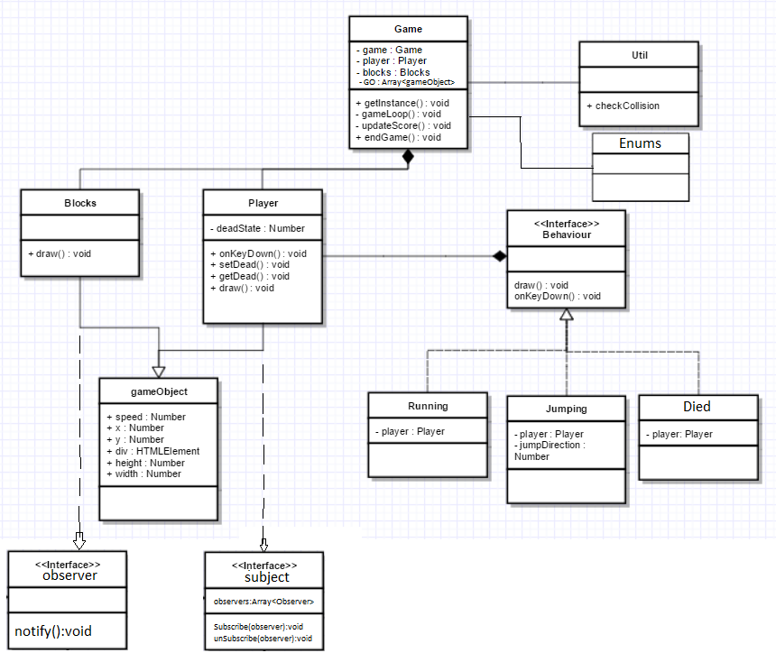

Installatie:
Typescript game die gebruik maakt van een singleton, een static utils class, een interface en strategy patterns.
Assesser kan een fork maken en deze pullen om lokaal de ts files te compilen naar js Vervolgens zullen deze in de docs folder te vinden
zijn om te runnen in de browser.

Interface:
Het bestand: Behaviour.ts, bevat een interface waar alle Behaviours gebruik van maken. Deze interface heeft maar 2 methods, een draw en 
een onkeydown. Draw is de gebruikte method om alle functionaliteiten mee te geven aan een Behaviour. Onkeydown wordt gebruikt om 
interactie met de gebruiker te creeëren. 

Static utility method:
Het util.ts bestand bevat 1 static method, checkCollision. Deze method wordt in game.ts aangeroepen om te kijken of er 2
gameObjects in contact komen met elkaar. Dit is een return functie die een true of false mee geeft.

Singleton:
Game.ts is de singleton. Op regel 25 van game.ts wordt de getInstance method aangemaakt voor het gebruik van de Singleton.
Op regel 72 van game.ts wordt de game aangemaakt mbv de singleton. Het 2e gebruik van de singleton is te
vinden in crashing.ts. Hier wordt de endGame method aangeroepen vanuit game.ts.

Strategy:
Zoals hierboven al is genoemd, de interface is behaviour.ts. Hier aan vast zitten crashing, jumping en running. Deze 3 zijn 
geïmplementeerd zoals we dat in de les hebben behandeld. In player.ts wordt 1 maal de variabele met behaviour gevuld door 
running.ts. Vervolgens wordt er 1 keer de functie draw aangeroepen die in de gameloop staat. Hierdoor kunnen de rest van
de behaviours aangroepen worden.

Encapsulation, Composition, Inheritance:
gameObject.ts is een class. behaviour.ts is een interface. gameObject.ts extend player.ts en block.ts. Deze 2 krijgen alle basis
functionaliteiten en gegevens van gameObject.ts. Player en block zijn dus gameObjects. Dit geldt ook voor alle behaviours,
Jumping, Running en Crashing zijn behaviours.
Game.ts maakt een player en een brick aan, game heeft dus een player en een brick.
Encapsulation wordt vrijwel in elk object gebruikt. Player heb ik 1 private variabele gegeven, deadState. Deze heeft een
get en set functie om aan te passen. Vooral Game heeft veel private methods en variabelen. Dit is ook omdat er weinig andere
objecten iets van game hoeven te weten. De rest van de classes daarentegen hebben wel veel op public staan, juist zodat
Game erbij kan.

Observer
Voor de observer heb ik 2 nieuwe ts files aangemaakt. Subject.ts en observer.ts. Deze 2 zijn allebei interfaces die worden geimplementeerd. De player implementeerd subject en block implementeerd observer. Het subject bevat de functies subscribe en unsubscribe. De subscribe functie voegt observers aan de array toe die subject heeft.
Om ervoor de zorgen dat ze elkaar kennen, wordt de player(subject) meegegeven aan elk block dat wordt aangemaakt. Op deze manier kunnen de observers zich subscriben aan het subject. 
Als laatst hebben de observers een notify functie waar het subject bij kan. Hiermee kan hij bepalen wat de observers gaan doen.

Static en abstract.
De static functie die ik gebruik komt uit util.ts. Hier staat een functie in om de collision mee te controleren, dit is een static function die altijd dezelfde soort parameters verwacht.
Als abstracte class gebruik ik gameObject. Dit is een class die nooit zelf aangemaakt moet worden. Het kon geen interface zijn omdat gameObject wel wordt gebruikt in een array voor polymorphisme.

Polymorphisme.
In de gameLoop van game.ts wordt deze aangeroepen. Er is een Array waar alle gameObjecten in staan (de blocks en player). Beide classes hebben een draw functie en in game.ts wordt eerst gekeken naar wat het precies is. Als het een player is wordt alleen de draw functie aangeroepen. Als het een block is worden er allerlei dingen utigevoerd die alleen de blocks moeten doen.

Namespaces & enumerations.
Beide zijn ingebouwd in enums.ts. De namespace die wordt gebruikt is Enums. Deze namespace bevat dimensies. De dimensies gebruik ik voor de enumerations.

Library.
Het library dat ik gebruik is TweenLite. Dit is een library dat wordt gebruikt voor het animeren van DOM elementen. In de index.html wordt een script ingeladen en het greensock.d.ts bestand wordt gebruikt om het bruikbaar te maken in Typescript.
In de functie endGame in game.ts wordt deze library aangeroepen om de eindtitel naar beneden te halen. Er wordt een div met tekst naar beneden gehaald om je eindscore te laten zien. (zie game.ts regels 94,95,96)